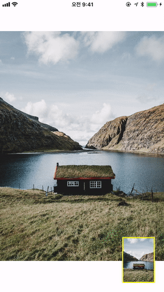

# THScrollView-minimap

[](http://cocoapods.org/pods)
[](https://github.com/younatics/YNDropDownMenu/blob/master/LICENSE)
[](https://travis-ci.org/younatics/YNDropDownMenu)
[](http://cocoapods.org/pods)
[](https://developer.apple.com/swift/)


## Feature
- [x] 🗺 Map will shows based on your ScrollView.
- [x] 🖍 Focused Box in MiniMap will follow user's sight and resizable.

## Demo



## Installation

### CocoaPods

To integrate `THScrollView-minimap` into your Xcode project using CocoaPods, specify it in your Podfile:

```
pod "THScrollView-minimap"
```

## Requirements

`THScrollView-minimap` is written in Swift 4, and compatible with iOS 9.0+


## How to use

```Swift
// StoryBoard에 MinimapView 위치 설정
// Set the position of MinimapView on the Storyboard
@IBOutlet weak var minimapView: MinimapView!

// minimap이 참고할 scrollView 와 imageView 설정(minimap에 originImageSize를 쓰게될 경우)
// Set the scrollView and the imageView which are referred by the minimap - 1. the case of using originImageSize
minimapDataSource = MyMinimapDataSource(scrollView: scrollView, thumbnailImage: imageView.image!, originImageSize: nil)
// minimap에 thumbnailImage를 쓸 경우
// 2. the case of using thumbnailImage
minimapDataSource = MyMinimapDataSource(scrollView: scrollView, thumbnailImage: UIImage(contentsOfFile: thumbnailImageURL.path)!, originImageSize: CGSize(width: 5214, height: 7300))

// mimimap의  borderWidth 설정
// Set the width of the minimap's border
minimapDataSource.borderWidth = 2.0

// minimap의 color 설정
// Set the color of the minimap's border
minimapDataSource.borderColor = UIColor.yellow

// minimap이 참고한 image 사이즈의 비율 정하기 (ex, image의 1/4 크기)
// Set the ratio of image Size which is referred by the minimap
minimapDataSource.downSizeRatio = 4.0

// minimapView에 설정
// Set the minimap
minimapView.set(dataSource: minimapDataSource)


// 그 후에 UIScrollViewDelegate의 scrollViewDidScroll에 다음과 같은 코드를 추가해 줍니다.
// Then, add the following codes on the ScrollViewDidScroll of the UIScrollViewDelegate
extension ViewController: UIScrollViewDelegate {
    public func scrollViewDidScroll(_ scrollView: UIScrollView) {
        minimapDataSource.resizeMinimapView(minimapView: minimapView)
    }
}
```


## MinimapView and Data Source

MinimapView draws the Minimap by referring ScrollView and the ImageView. You can set the attributes for drawing the view by using MinimapDatasource


## License

`THScrollView-minimap` is released under the MIT license. [See LICENSE](https://github.com/TileImageTeamiOS/THScrollView-minimap/blob/master/LICENSE) for details.
